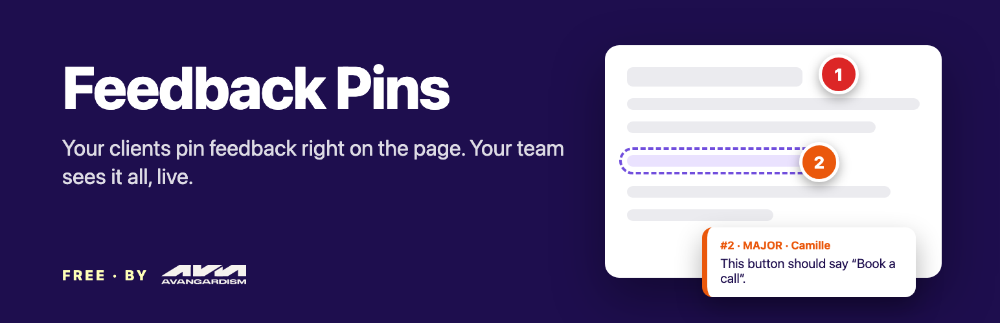
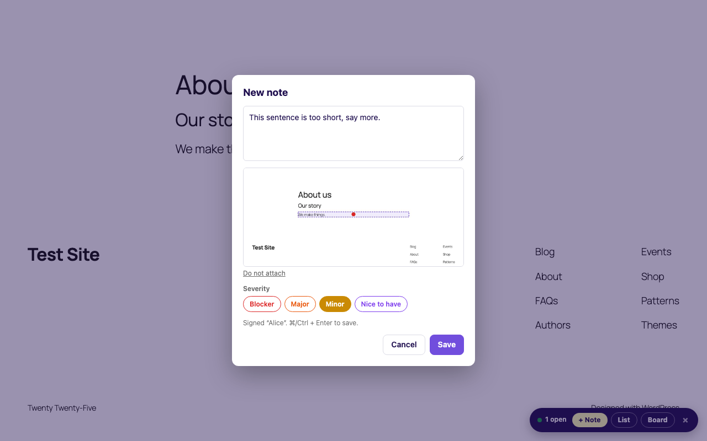
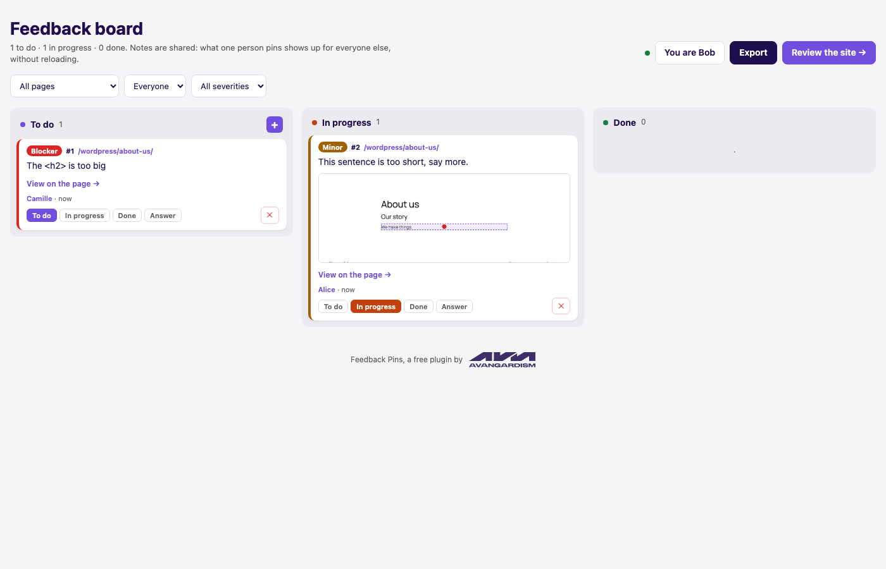
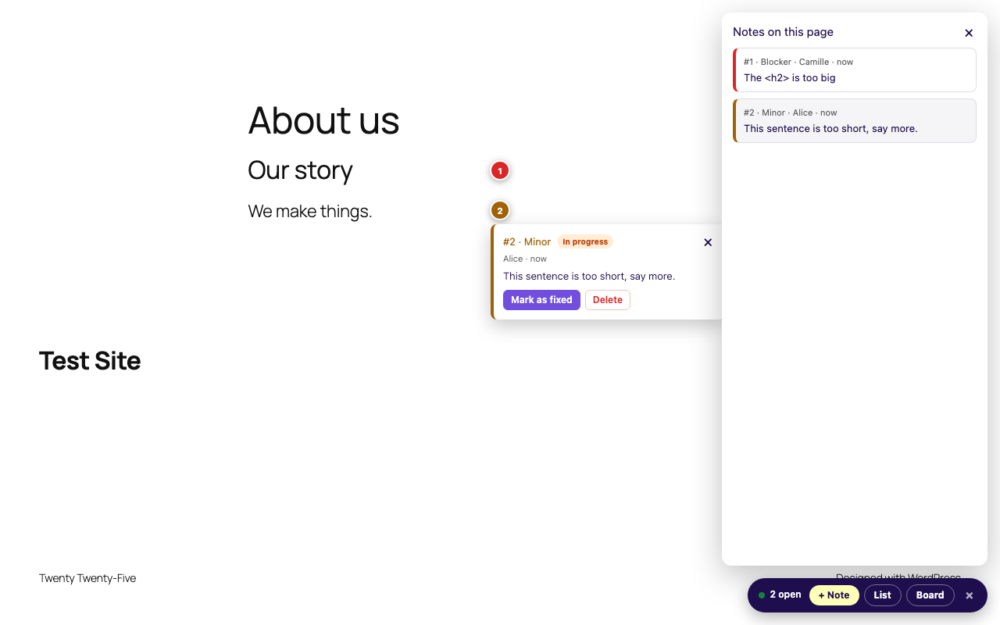

# Feedback Pins

**Français** · [English](README.md)



**Vos clients épinglent leurs remarques directement sur la page. Votre équipe voit tout, en direct, sur un seul tableau.**

Une extension WordPress gratuite, par [AVANGARDISM](https://avangardism.com/?utm_source=github&utm_medium=readme-fr&utm_campaign=feedback-pins). Pas de compte, pas de SaaS, pas de version premium : les remarques et les captures restent dans votre propre WordPress.

---

## Pourquoi

Les retours sur un site arrivent d'habitude en pile d'e-mails, avec des captures floues et des « le bouton sur la page, tu sais, le bleu ». Feedback Pins pose chaque remarque exactement là où elle doit être : sur l'élément lui-même.

1. Envoyez à votre client le lien d'invitation, depuis **Outils > Feedback Pins**.
2. Il clique sur **+ Remarque**, puis sur n'importe quel élément, écrit, enregistre.
3. Une capture d'écran est jointe, une pastille numérotée reste posée sur l'élément.
4. Toutes les personnes qui ont ouvert le lien voient les remarques des autres en moins de 15 secondes, sur la page comme sur le tableau.
5. Faites passer les cartes de *À faire* à *En cours* puis *Terminé*, répondez, exportez en Markdown.

| Épingler une remarque | Le tableau | Sur la page |
|---|---|---|
|  |  |  |

## Fonctionnalités

- Remarques épinglées sur n'importe quel élément de n'importe quelle page, avec la section, la taille d'écran et le navigateur enregistrés
- Capture d'écran automatique, élément encadré et point de clic marqué
- Partage en temps réel entre toutes les personnes qui relisent, sur les pages et sur le tableau
- Tableau en trois colonnes : glisser-déposer, filtres par page, par personne et par gravité, réponses
- Liens « Voir sur la page » qui font défiler jusqu'à l'élément et le font clignoter
- Notifications Slack avec la capture, envoyées par votre propre serveur
- Export Markdown et JSON groupé par page et par section, prêt pour un ticket ou un assistant IA
- Raccourci dans la barre d'administration : relire la page en cours en un clic
- Environ 500 octets pour les visiteurs ordinaires : tout le reste est chargé à la demande
- Compatible avec les caches de pages (le mode recette est décidé dans le navigateur)
- Accessible : ajout au clavier seul (Tab + Entrée), annonces pour les lecteurs d'écran, contrastes WCAG AA, vérifié avec axe-core
- Traduisible, français inclus

## Installation

**Depuis WordPress.org** (une fois publiée) : *Extensions > Ajouter*, cherchez « Feedback Pins ».

**Depuis GitHub** : téléchargez le zip de la [dernière version](https://github.com/avangardism-alex/feedback-pins/releases/latest), puis *Extensions > Ajouter > Téléverser une extension*.

Nécessite WordPress 6.3+ et PHP 7.4+.

## Où tourne Slack ?

Sur votre serveur. Quand une remarque est créée, votre WordPress appelle directement votre webhook Slack, après avoir déjà répondu à la personne qui relit (`fastcgi_finish_request` quand c'est disponible) : personne n'attend Slack. Aucun serveur AVANGARDISM au milieu, rien à héberger, rien à payer : chaque site utilise son propre webhook.

## Sécurité

- Une clé partagée protège les remarques. Sans elle, l'API REST répond 401, en lecture comme en écriture.
- La clé voyage dans le fragment de l'adresse (`#fpins_key=…`), jamais envoyé au serveur ni aux outils de statistiques, et elle est retirée de la barre d'adresse dès l'arrivée. Ensuite, elle passe dans l'en-tête `X-Feedback-Pins-Key`.
- Générer une nouvelle clé dans les réglages désactive tous les liens envoyés avant.
- Les remarques sont du texte brut, toujours affichées avec `textContent` dans le navigateur et `esc_*` en PHP.
- Les captures sont vérifiées comme de vraies images JPEG/PNG, limitées à 3 Mo, et stockées sous des noms aléatoires.

## Développeurs

Constantes (dans `wp-config.php`) :

```php
define( 'FPINS_KEY', 'votre-propre-cle' );                            // clé fixe
define( 'FPINS_SLACK_WEBHOOK', 'https://hooks.slack.com/services/…' ); // webhook hors de la base
```

Filtres et actions :

| Hook | Défaut | Rôle |
|---|---|---|
| `fpins_board_path` | `feedback-board` | Chemin du tableau |
| `fpins_capability` | `manage_options` | Qui voit les réglages et le raccourci de la barre d'admin |
| `fpins_sync_interval` | `15000` | Intervalle de relecture en ms (minimum 5000) |
| `fpins_notes_limit` | `1000` | Nombre maximal de remarques renvoyées |
| `fpins_note` | | Filtre une remarque avant le navigateur ou Slack |
| `fpins_slack_message` | | Filtre le message Slack (Block Kit) |
| `fpins_note_created` (action) | | Déclenchée après la création d'une remarque : branchez e-mail, Teams, Discord… |

Routes REST sous `/wp-json/feedback-pins/v1/` : `GET|POST notes`, `POST|DELETE notes/{id}`, `GET strings`.

### Organisation du code

```
feedback-pins.php      amorçage
includes/notes.php     type de contenu, champs, nettoyage, clé
includes/rest.php      API REST
includes/screenshots.php
includes/slack.php
includes/front.php     chargeur, page du tableau, barre d'admin, textes JS
includes/admin.php     Outils > Feedback Pins
assets/js/             barre + tableau (JavaScript natif, sans compilation)
assets/vendor/         html2canvas 1.4.1 (MIT)
languages/             .pot + français
uninstall.php          supprime remarques, captures et réglages
```

Pas de compilation, pas de Composer, pas de npm : ce que vous voyez est ce qui est distribué.

### Traductions

```bash
wp i18n make-pot . languages/feedback-pins.pot --exclude=assets/vendor --skip-js
msgfmt -o languages/feedback-pins-fr_FR.mo languages/feedback-pins-fr_FR.po
wp i18n make-php languages
```

Les textes JavaScript sont déclarés dans `fpins_js_strings()` (`includes/front.php`) pour être extraits avec ceux du PHP.

### Publier une version

Poussez un tag `v1.2.3` : le workflow GitHub construit le zip et le joint à la release. Si les secrets `SVN_USERNAME` et `SVN_PASSWORD` sont définis, il publie aussi sur WordPress.org.

## Contribuer

Les tickets et pull requests sont bienvenus. Merci de rester sans dépendance et de passer [Plugin Check](https://wordpress.org/plugins/plugin-check/) avant d'ouvrir une PR.

## Licence

GPL-2.0-or-later. html2canvas est sous licence MIT, voir `assets/vendor/html2canvas-LICENSE.txt`.

---

Besoin d'un site, d'une boutique en ligne ou d'un logiciel métier ? [Parlons de votre projet](https://avangardism.com/contact?utm_source=github&utm_medium=readme-fr&utm_campaign=feedback-pins).
